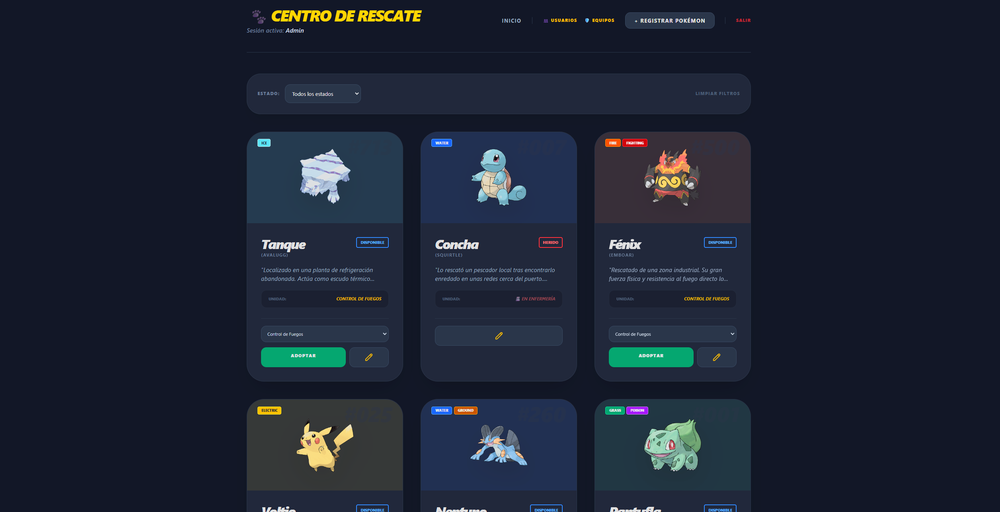
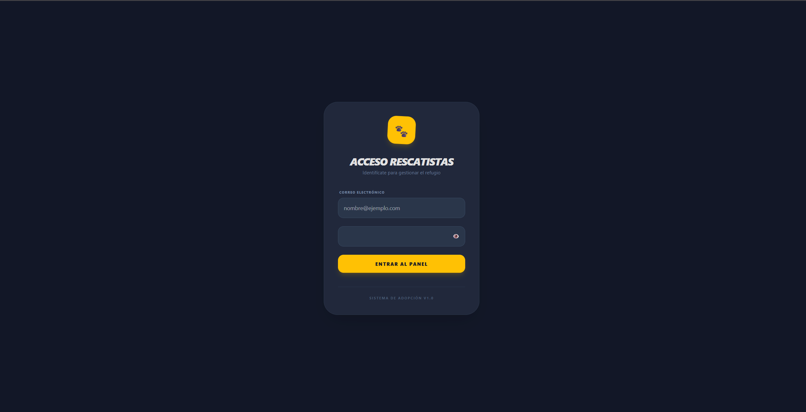

# Pokémon Rescue & Team Manager (MVP)

This project is a web application designed for managing rescue operations and personnel, built with PHP and integrated with Supabase (PostgreSQL). Although themed around the Pokémon universe (leveraging the PokeAPI), the system's core features an Access Control and Team Management system engineered to coordinate emergency missions.

---

## Key Features

* **Role-Based Access Control (RBAC):** Secure login system with BCRYPT encryption, differentiating between Administrator (full system management) and Rescuer (field operations) roles.
* **Specialized Units:** Tools to create rescue teams based on terrain or specialty (e.g., Fire, Water, Seismic) and dynamically assign available personnel.
* **Status & Log Management:** Internal logic tracking status changes (e.g., "Injured" to "Available") with an automated log recording medical clearances and duty assignments.
* **API Integration:** Consumes PokeAPI to automate data fetching, handling sprite imagery and type alignments dynamically.
* **Advanced Filtering:** Control dashboard featuring multi-criteria live filters by operational status and assigned unit.

---

## Visual Preview

  <em>Figure 1: Main Administrative Dashboard and Unit Overview.</em>

  <em>Figure 2: Access Control and Authentication Interface.</em>

---

## Built With

* **Backend:** PHP 8.x (Modular architecture using PDO)
* **Database:** Supabase (PostgreSQL cloud hosting)
* **Frontend:** Tailwind CSS (Responsive layout and native Dark Mode)
* **External Services:** PokeAPI